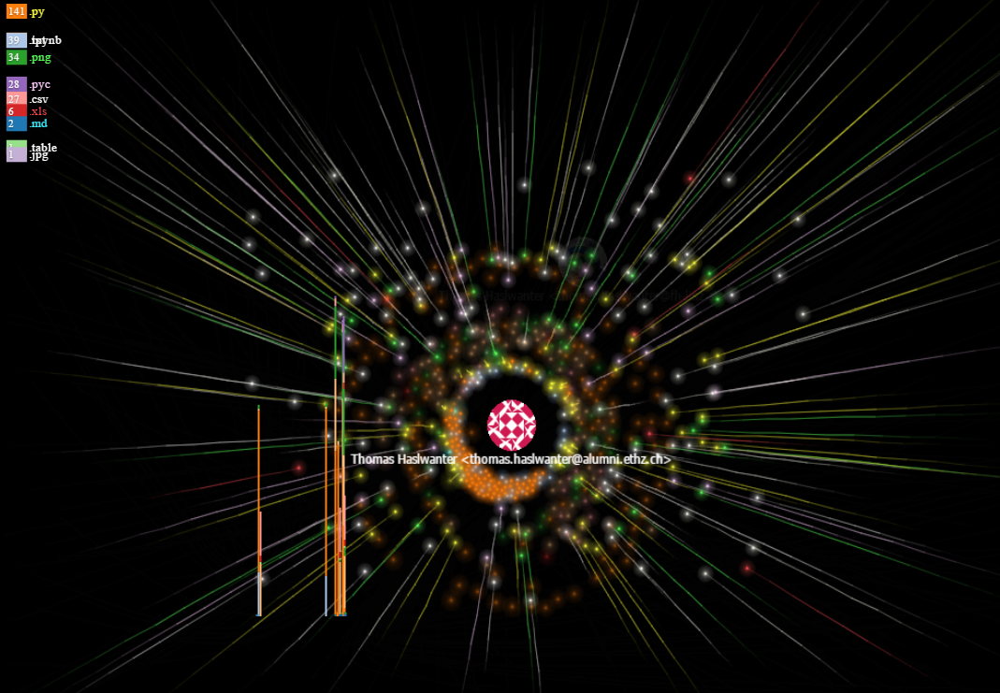
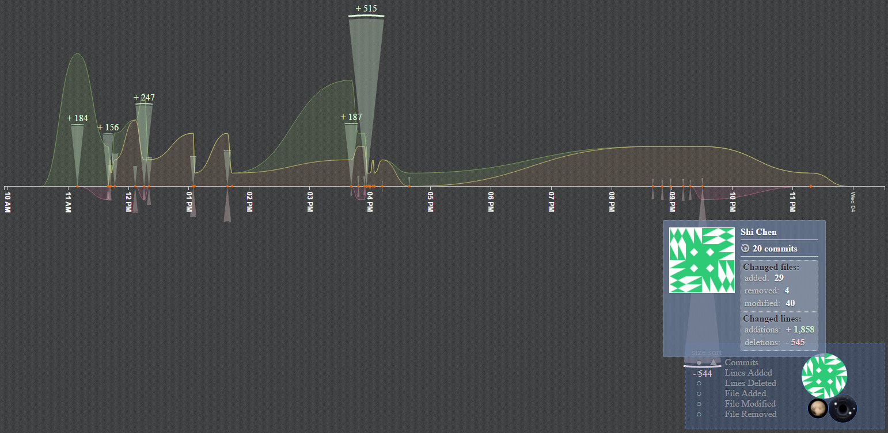
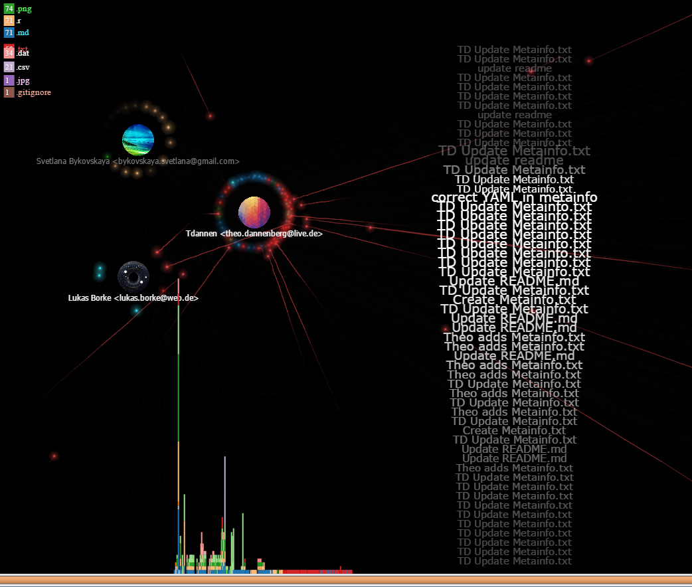
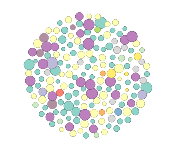
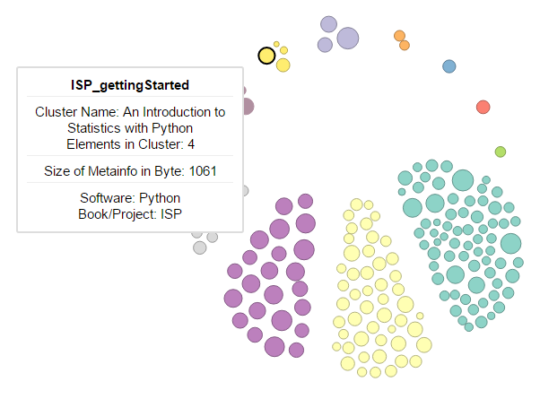
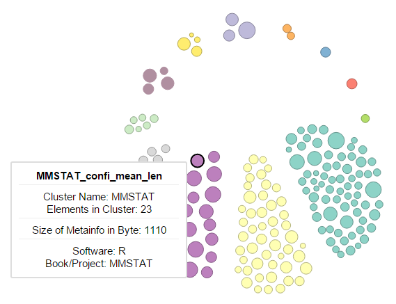
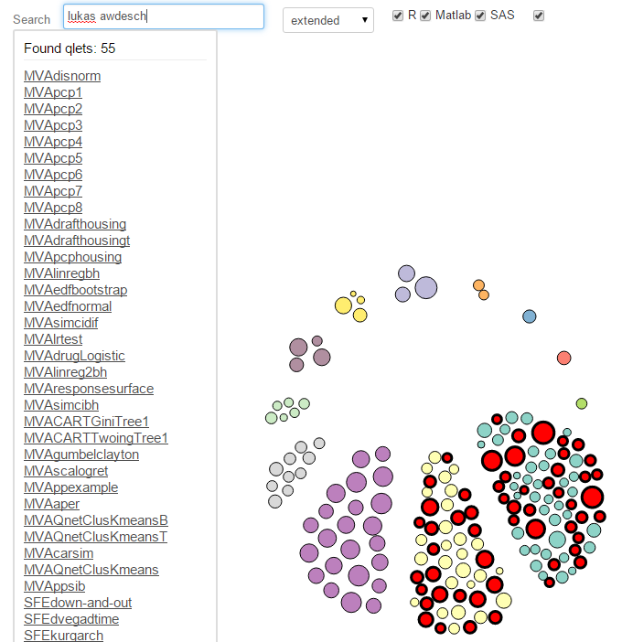

#  **Git2Q3-Collaboration**

## Collaborative development of Quantlets

Some Examples:

1. [Collaboration_Example_MVAlaplacedis](https://github.com/QuantLet/Collaboration_Example_MVAlaplacedis)
2. [Collaboration_Example_MVAghdis](https://github.com/QuantLet/Collaboration_Example_MVAghdis)
3. [Collaboration_Example_MVAghadatail](https://github.com/QuantLet/Collaboration_Example_MVAghadatail)

## Collaboration Visualization of selected repositories of this organisation:

[go to Collaboration Visualization](ReposCollaboration.md)

## Git2gether
###[Interactive D3 Visualization: created by GitHub-R-API implementation](http://quantnet.wiwi.hu-berlin.de/d3/ia/)

#### All quantlets from GitHub

#### Clustered by repository/book/project: one Python quantlet from ISP selected

#### Clustered by repository/book/project: one R quantlet from MMSTAT selected

#### Integrated search function:  all quantlets having Lukas or Awdesch as author are highlighted

