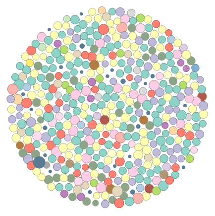
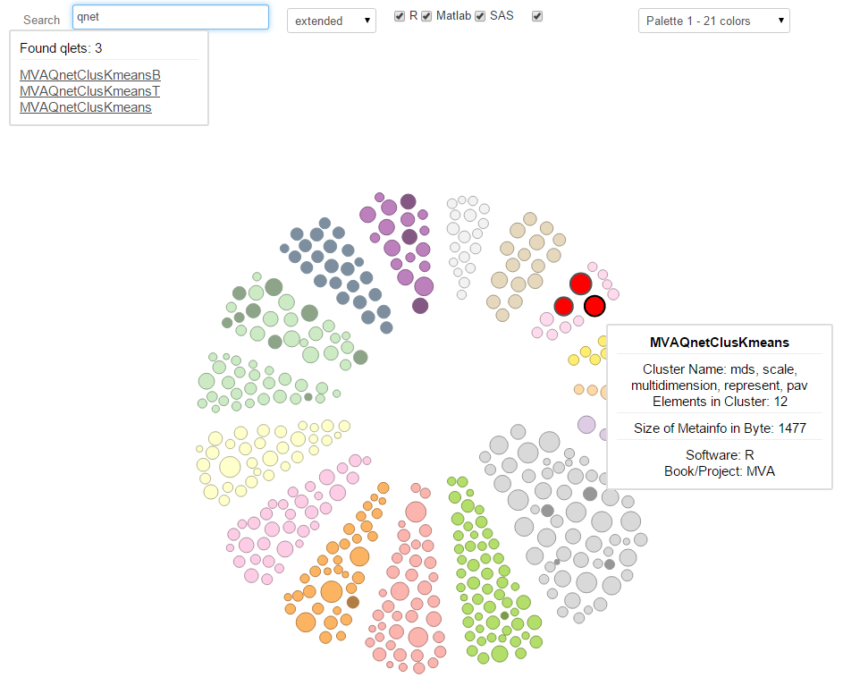
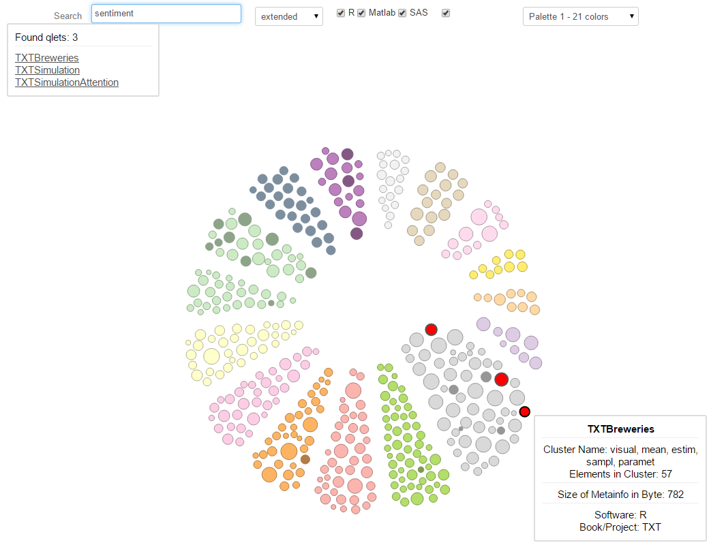
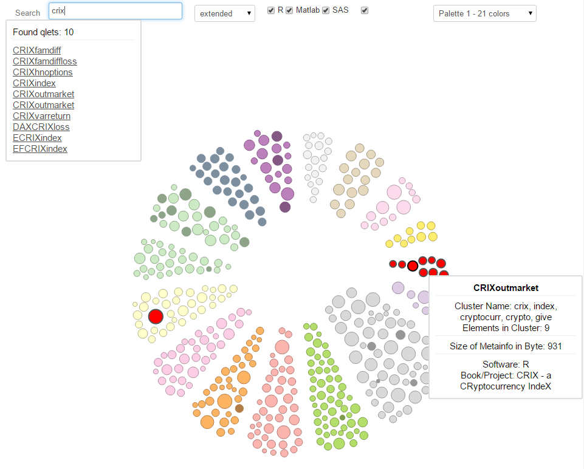
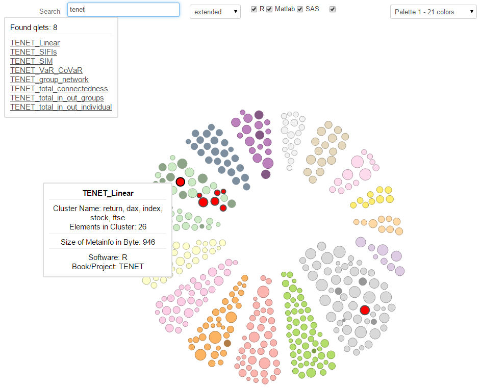

#  **Git2Q3-Collaboration** 

## Build software better, together, now (QuantNet 2.0 @ GitHub)

## Collaborative development of Quantlets

Some Examples:

1. [Collaboration_Example_MVAlaplacedis](https://github.com/QuantLet/Collaboration_Example_MVAlaplacedis)
2. [Collaboration_Example_MVAghdis](https://github.com/QuantLet/Collaboration_Example_MVAghdis)
3. [Collaboration_Example_MVAghadatail](https://github.com/QuantLet/Collaboration_Example_MVAghadatail)

## Collaboration Visualization of selected repositories of this organisation:

[go to Collaboration Visualization](ReposCollaboration.md)

Collaboration on MVA-Ready over time, created via GitHub-Api:

The whole GitHub universe, all users with more than 2 followers

## Git2gether
###[Interactive D3 Visualization: created by GitHub-R-API implementation](http://quantnet.wiwi.hu-berlin.de/d3/ia/)

#### All quantlets from GitHub - unclustered

#### Clustered by repository/book/project: one Python quantlet from ISP selected

#### Clustered by repository/book/project: one R quantlet from MMSTAT selected

#### Integrated search function:  all quantlets having Lukas or Awdesch as author are highlighted

 
#### Clustered via LSA model, 16 clusters: all 3 Qs with the word "qnet" are assigned to the cluster 'mds, scale, multidimension, ...'

 
#### Clustered via LSA model, 16 clusters: all 3 Qs with the word "sentiment" are assigned to the cluster 'visual, mean, estim(ation), ...'

 
#### Clustered via LSA model, 16 clusters: 9 of 10 Qs with the word "crix" are assigned to the cluster 'crix, index, cryptocurr(ancy), ...'. This cluster consists entirely of "crix"-Qs.

 
#### Clustered via LSA model, 16 clusters: 7 of 8 Qs with the word "tenet" are assigned to the cluster 'return, dax, index, ...'.

