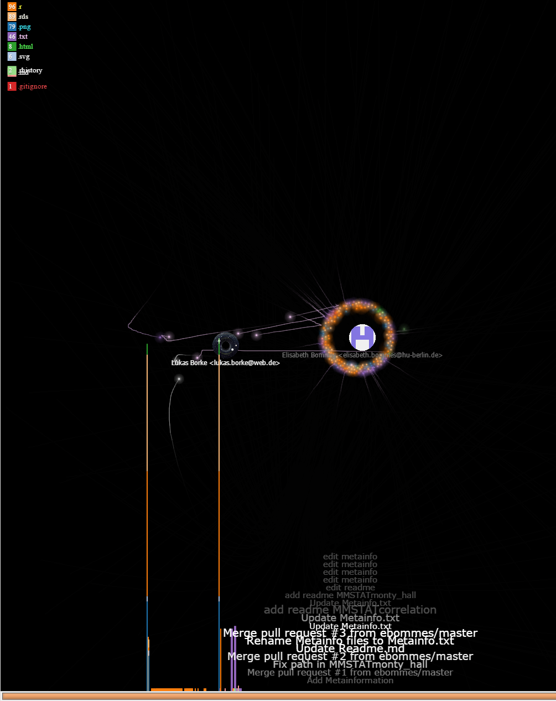

#  **Git2Q3-Collaboration**

## Collaborative development of Quantlets

Some Examples:

1. [Collaboration_Example_MVAlaplacedis](https://github.com/QuantLet/Collaboration_Example_MVAlaplacedis)
2. [Collaboration_Example_MVAghdis](https://github.com/QuantLet/Collaboration_Example_MVAghdis)
3. [Collaboration_Example_MVAghadatail](https://github.com/QuantLet/Collaboration_Example_MVAghadatail)

## Collaboration Timeline of selected repositories of this organisation:

[MMSTAT](https://github.com/QuantLet/MMSTAT)

