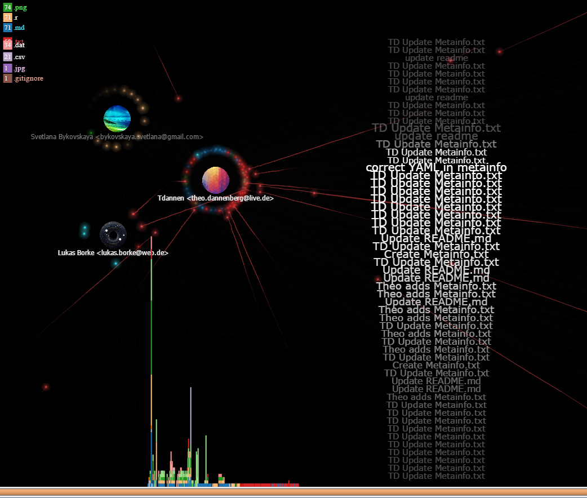
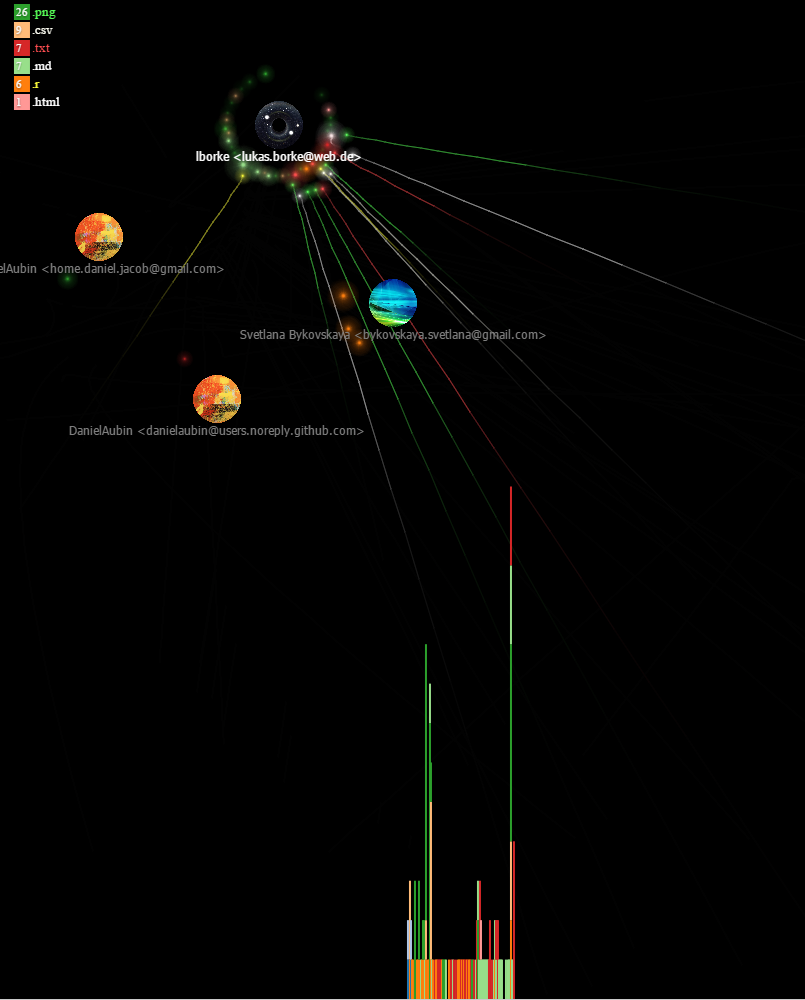
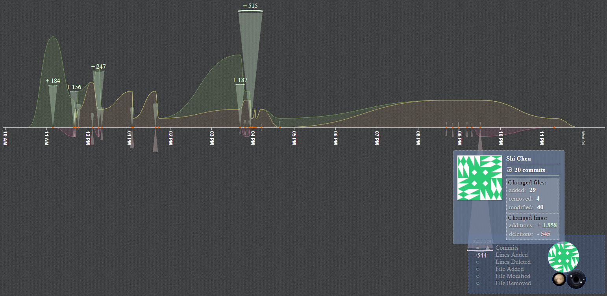
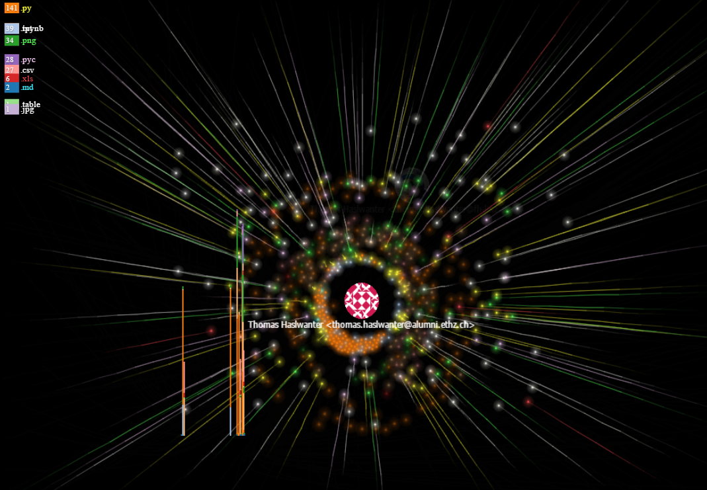
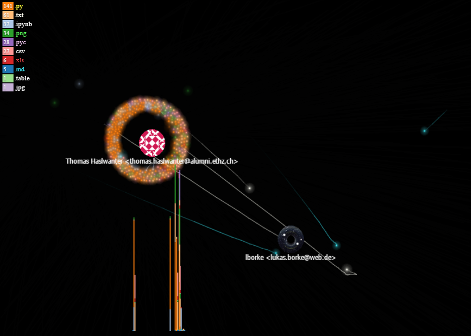
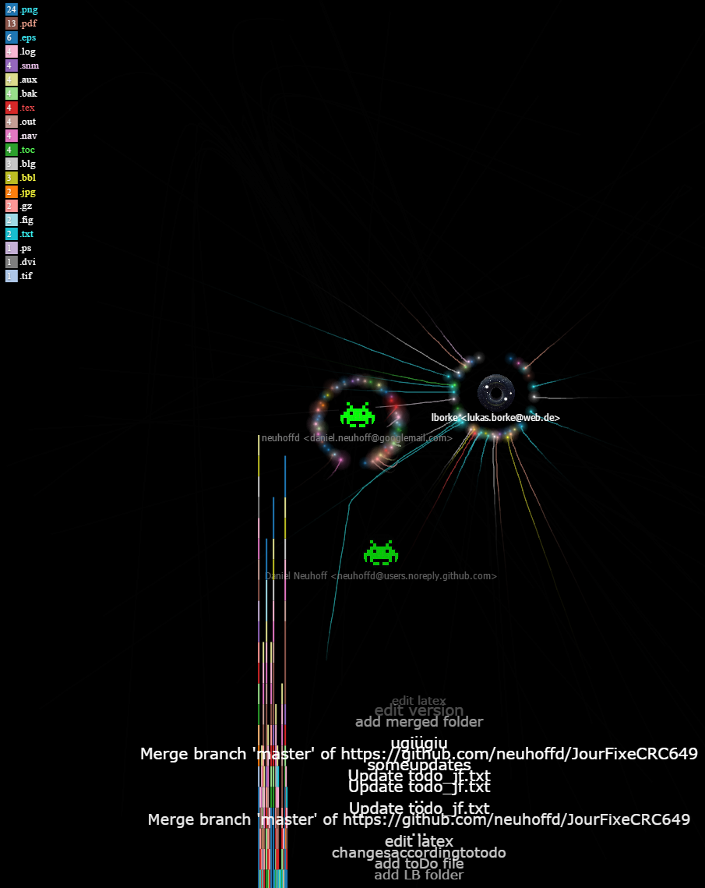
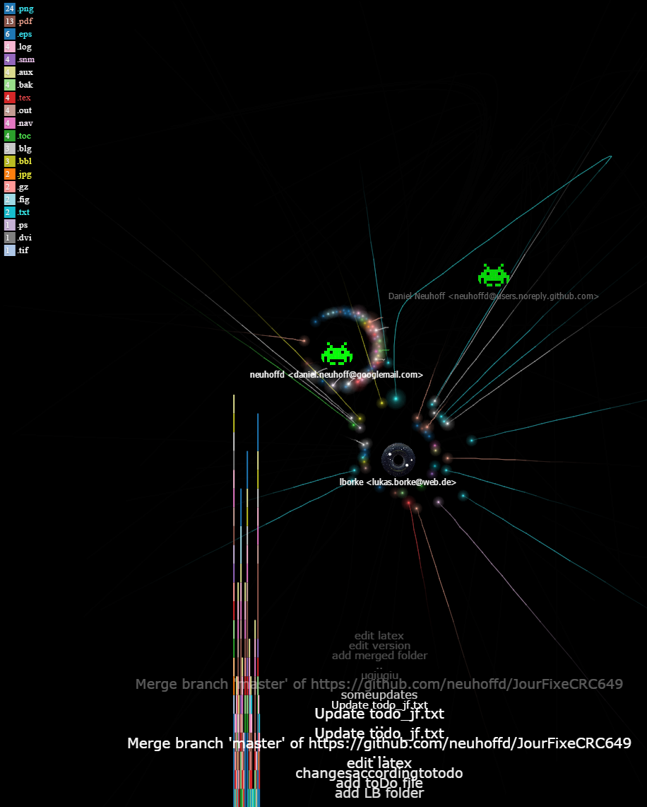
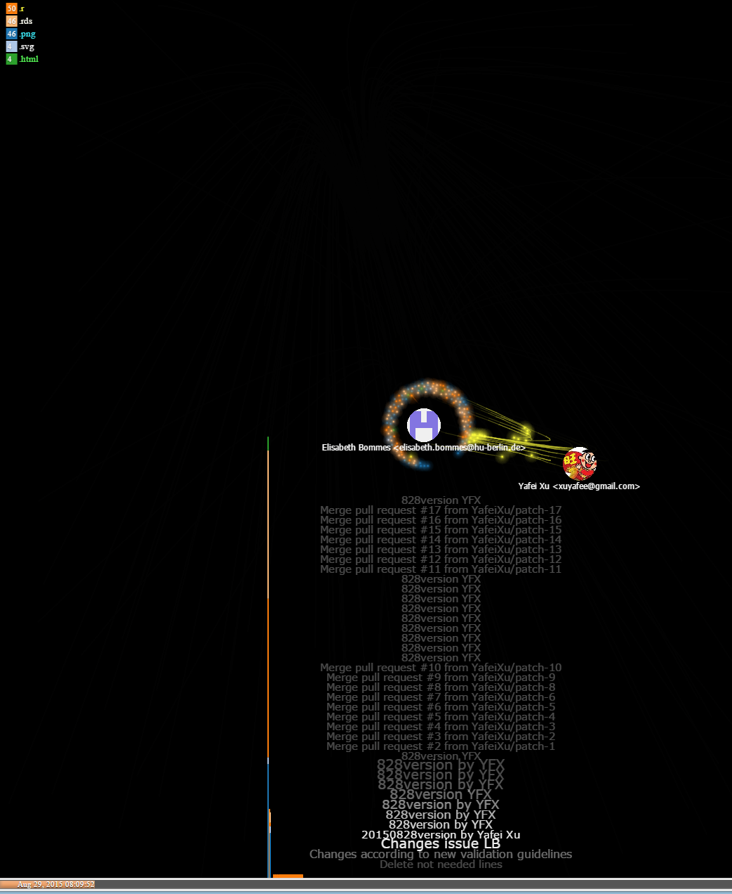
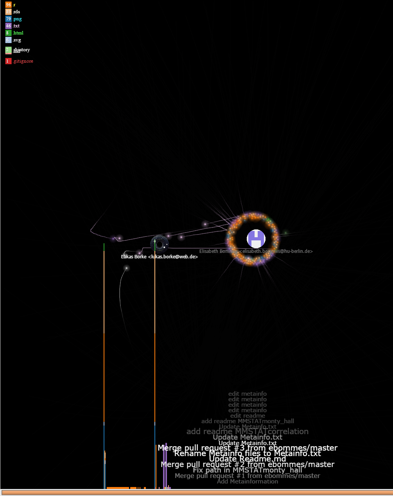
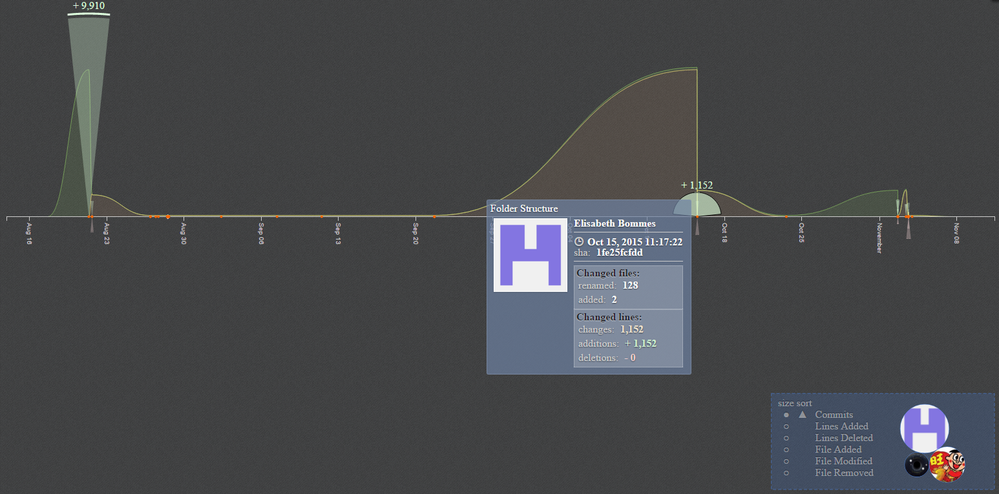

## Collaboration Timeline and Visualization of selected repositories of this organisation:

### [Ready - Repository](https://github.com/QuantLet/MVA-Ready)

### [Big Data Analysis - Repository](https://github.com/QuantLet/big_data_analysis)

### [SRM - Repository](https://github.com/QuantLet/SRM)

### [ISP - Repository](https://github.com/thomas-haslwanter/statsintro_python)

### [JourFixeCRC649 - Repository](https://github.com/neuhoffd/JourFixeCRC649)

### [MMSTAT - Repository](https://github.com/QuantLet/MMSTAT)

